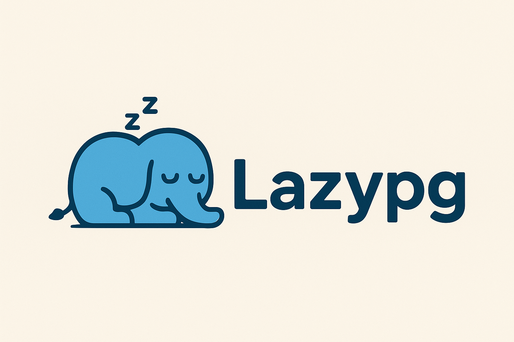
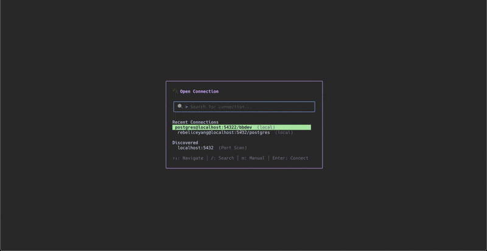
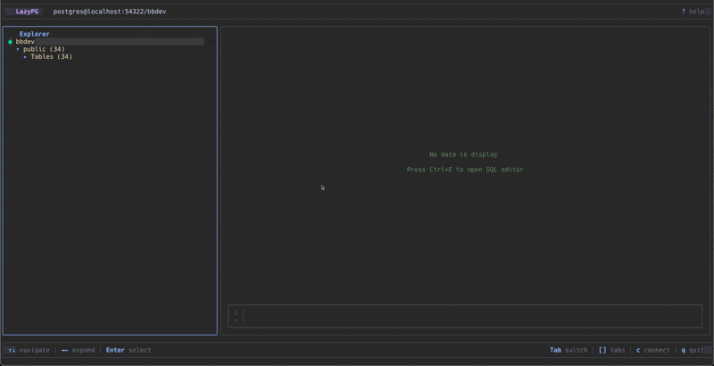
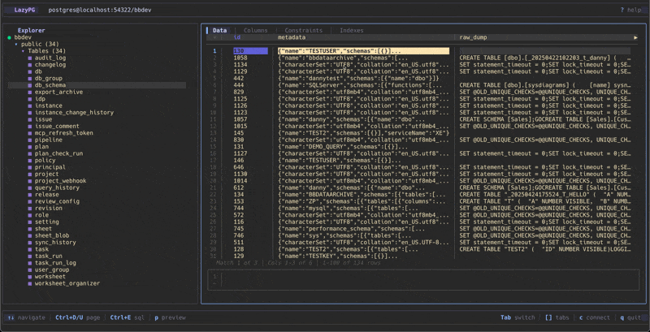
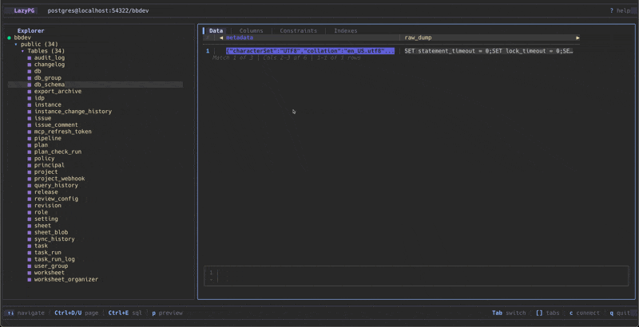
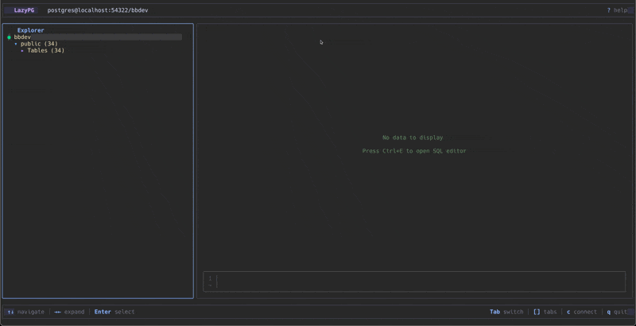
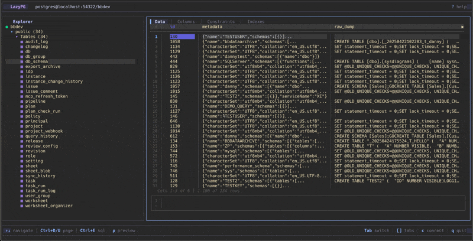

# lazypg

<!-- TODO: Add logo here -->
<!-- <p align="center">
  
</p> -->

<p align="center">
  <strong>A simple terminal UI for PostgreSQL, written in Go with the <a href="https://github.com/charmbracelet/bubbletea">Bubble Tea</a> framework.</strong>
</p>

<p align="center">
  <a href="https://github.com/rebeliceyang/lazypg/releases"></a>
  <a href="https://github.com/rebeliceyang/lazypg/actions"></a>
  <a href="https://github.com/rebeliceyang/lazypg/blob/main/LICENSE"></a>
  <a href="https://goreportcard.com/report/github.com/rebeliceyang/lazypg"></a>
</p>

<p align="center">
  <a href="#features">Features</a> •
  <a href="#installation">Installation</a> •
  <a href="#quick-start">Quick Start</a> •
  <a href="#keybindings">Keybindings</a> •
  <a href="#configuration">Configuration</a> •
  <a href="#documentation">Docs</a>
</p>

---

> **Status: Beta** — Core features are stable and ready for daily use. See [Roadmap](docs/ROADMAP.md) for planned features.

## Why lazypg?

If you're anything like me, you love PostgreSQL but hate context-switching between your terminal and a heavy GUI client just to peek at some data. You want something that:

- **Stays in your terminal** — no Electron, no browser tabs, just your good old terminal
- **Respects your muscle memory** — Vim-style navigation because your fingers already know the way
- **Gets out of your way** — connect, browse, filter, done

That's lazypg. Inspired by [lazygit](https://github.com/jesseduffield/lazygit), built for developers who live in the terminal.

<!-- TODO: Add main demo GIF -->
<!-- <p align="center">
  
</p> -->

## Features

### Database Navigation

Browse your databases, schemas, and tables with a familiar tree structure. Expand, collapse, and jump around with keyboard shortcuts you already know.

<!-- TODO: Add navigation GIF -->
<!--  -->

### Interactive Filtering

Build complex WHERE clauses visually. No more hand-typing SQL for simple filters — just press `f`, pick your column, choose an operator, and go.

<!-- TODO: Add filtering GIF -->
<!--  -->

### JSONB Viewer

JSONB columns are first-class citizens. View them formatted, navigate as a tree, or get ready-to-use query snippets.

<!-- TODO: Add JSONB GIF -->
<!--  -->

### Command Palette

Quick access to everything via `Ctrl+K`. Search commands, jump to tables, or access recent queries — all without leaving the keyboard.

<!-- TODO: Add command palette GIF -->
<!--  -->

### SQL Editor

Write and execute SQL directly. Results appear in tabs, so you can run multiple queries and compare results.

<!-- TODO: Add SQL editor GIF -->
<!--  -->

### And More...

- **Query Favorites** — Save and organize frequently used queries
- **Auto-Discovery** — Automatically find local PostgreSQL instances
- **Mouse Support** — Click, scroll, double-click when you want to
- **Connection History** — Quick reconnect to recent databases
- **Vim Motions** — `gg`, `G`, `Ctrl+D`, `Ctrl+U`, relative line numbers

## Installation

### Homebrew (macOS/Linux)

```bash
# Coming soon
brew install rebeliceyang/tap/lazypg
```

### Go Install

```bash
go install github.com/rebeliceyang/lazypg@latest
```

### Download Binary

Download the latest release from the [Releases page](https://github.com/rebeliceyang/lazypg/releases).

### Build from Source

```bash
git clone https://github.com/rebeliceyang/lazypg.git
cd lazypg
make build
./bin/lazypg
```

### Requirements

- Go 1.21+ (for building from source)
- PostgreSQL 12+ (for connecting)

## Quick Start

1. **Launch lazypg**
   ```bash
   lazypg
   ```

2. **Connect to a database**
   - Press `c` to open the connection dialog
   - Select a discovered instance or enter connection details manually
   - Press `Enter` to connect

3. **Navigate your data**
   - Use `hjkl` or arrow keys to move around
   - Press `Enter` to expand nodes or select tables
   - Press `Tab` to switch between panels

4. **Filter and explore**
   - Press `f` to open the filter builder
   - Press `j` on a JSONB cell to open the viewer
   - Press `Ctrl+K` to open the command palette

5. **Get help**
   - Press `?` to see all keyboard shortcuts

## Keybindings

### Global

| Key | Action |
|-----|--------|
| `Ctrl+K` | Open command palette |
| `Ctrl+E` | Open SQL editor |
| `Tab` | Switch panels |
| `?` | Show help |
| `q` | Quit |

### Navigation

| Key | Action |
|-----|--------|
| `h` `j` `k` `l` | Move left/down/up/right |
| `g` / `G` | Jump to top/bottom |
| `Ctrl+D` / `Ctrl+U` | Page down/up |
| `Enter` | Select / Expand |
| `Esc` | Close dialog / Cancel |

### Data View

| Key | Action |
|-----|--------|
| `f` | Open filter builder |
| `Ctrl+F` | Quick filter from cell |
| `Ctrl+R` | Clear filters |
| `j` | Open JSONB viewer (on JSONB cell) |
| `p` | Toggle preview pane |
| `s` | Sort by column |
| `[` / `]` | Previous/Next tab |

### SQL Editor

| Key | Action |
|-----|--------|
| `Ctrl+S` | Execute query |
| `Ctrl+O` | Open in external editor |
| `Esc` | Close editor |

## Configuration

lazypg stores configuration in `~/.config/lazypg/`:

### Main Config (`config.yaml`)

```yaml
ui:
  theme: "default"          # Color theme
  panel_width_ratio: 25     # Left panel width percentage
  mouse_enabled: true       # Enable mouse support

editor:
  external: "vim"           # External editor for Ctrl+O
```

### Saved Connections (`connections.yaml`)

```yaml
connections:
  - name: "Local Dev"
    host: localhost
    port: 5432
    database: mydb
    user: postgres
    ssl_mode: prefer

  - name: "Production (readonly)"
    host: prod-db.example.com
    port: 5432
    database: prod
    user: readonly_user
    ssl_mode: require
```

## Documentation

- [Documentation Index](docs/INDEX.md) — Full documentation
- [Filtering Guide](docs/features/filtering.md) — Interactive filter builder
- [JSONB Support](docs/features/jsonb.md) — Working with JSONB data
- [Query Favorites](docs/features/favorites.md) — Save and manage queries
- [Development Guide](docs/DEVELOPMENT.md) — Contributing to lazypg
- [Roadmap](docs/ROADMAP.md) — Planned features

## Contributing

Contributions are welcome! Whether it's bug reports, feature requests, or pull requests — all are appreciated.

```bash
# Setup
git clone https://github.com/rebeliceyang/lazypg.git
cd lazypg
make deps

# Development
make build    # Build binary
make test     # Run tests
make lint     # Run linter
make fmt      # Format code
```

Please read [DEVELOPMENT.md](docs/DEVELOPMENT.md) before submitting a PR.

## Acknowledgments

lazypg wouldn't exist without these amazing projects:

- [lazygit](https://github.com/jesseduffield/lazygit) — The inspiration for this project
- [Bubble Tea](https://github.com/charmbracelet/bubbletea) — The TUI framework
- [Lip Gloss](https://github.com/charmbracelet/lipgloss) — Terminal styling
- [pgx](https://github.com/jackc/pgx) — PostgreSQL driver for Go
- [Bubblezone](https://github.com/lrstanley/bubblezone) — Mouse support

## License

[MIT](LICENSE) — feel free to use this in your own projects.
